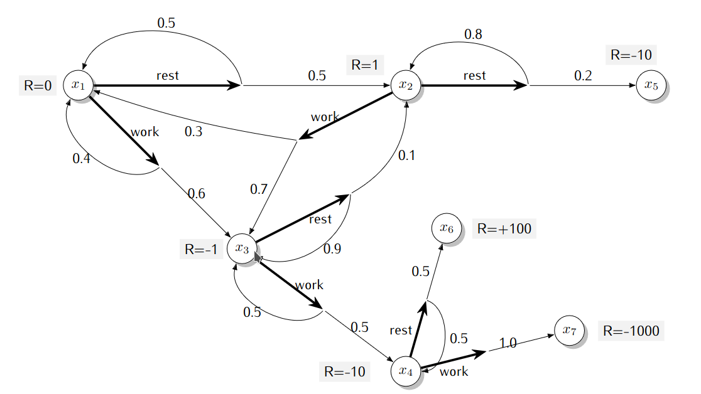

# TP n°1 : Processus de décision de Markov

Dans ce TP, on s'intéresse aux processus de décision de Markov. Les compétences travaillées durant cette activité sont les suivantes :

- Comprendre les MDP
- Modéliser un système d'apprentissage par renforcement comme un MDP

## Problème 1 : Trouver un job

Alice doit trouver un nouvel emploi. Aujourd'hui elle a trois heure devant elle. Son CV est prêt, elle n'a plus qu'à l'envoyer à sa liste d'entreprises mais elle hésite. Au début de chaque heure, Alice doit décider si elle envoie son CV à une entreprise ou si elle regarde une série. Si elle décide d'envoyer son CV, elle a 40% de chance de recevoir une réponse immédiatement (ce qui lui procure 10 points de bonheur). Sans réponse, elle aura 5 points de malheur. Une fois le CV envoyé, elle ne peut pas directement en renvoyer un. Elle doit d'abord choisir entre adapter son CV à l'entreprise suivante ou regarder une série. Ces actions ne lui procure ni bonheur, ni malheur.

1. Décrire le problème sous forme d'un MDP. Donnez notamme $\mathcal{S}, \mathcal{A}, \mathcal{T} et\ \mathcal{R}$. Quel est l'horizon de planification ? Quel est le _discount factor_ ?
2. Donner le graphe représentant ce processus.
3. Soit la politique déterministe $\pi$ donnée par

   $\forall s \ \mathcal{S},\ \pi(s) = Wait$

   Donner $v_{\pi}$

4. Soit la politique déterministe $\pi$ donnée par

   $\forall s \ \mathcal{S},\ \pi(s) = Apply$

   Donner $v_{\pi}$ et montrez que $v_{\pi} = v_{*}$

## Problème 2 : Retraite du cambriolage

Au début de chaque nuit, un cambrioleur doit décider s’il prend sa retraite de sa vie de cambrioleur. Si il
décide de continuer, il doit aussi décider s’il fait un ou deux cambriolage pendant la nuit. Si le cambriolage
est un succès, il gagne en moyenne 500€. Chaque cambriolage a une probabilité de 75% de réussir. Si un
cambriolage échoue, le cambrioleur perd tous les gains de la nuit (et ne peut pas faire un autre cambriolage
cette nuit là !) et le cambrioleur est condamné avec sursis. Si le cambrioleur est pris une seconde fois, c’est
fini ! Le cambrioleur est mis en prison et il est forcé de prendre sa retraite. Dans ce cas, le cambrioleur
évalue cette fin comme une perte de 5 000€.

1. Formulez ce problème comme un MDP : quels sont les états, les actions, le modèle de transition et le modèle de récompenses. Vous pouvez faire un schéma et l’étiquetter de manière claire.

2. Donnez explicitement (avec des nombres ou des fractions) l’équation de Bellman optimale pour ce MDP

## Problème 3 : Rest / Work

Les actions sont indiquées avec des flêches en gras, la fonction de transition avec des flêches plus fines et
l’indication des probabilités. La fonction de récompenses est deterministe et est indiquée par l’étiquette `R = value`.

1. Si un agent effectue la séquence d’action $(work,work,rest)$ à partir de l’état $x_1$, dans quels états peut-il se retrouver et avec quelle probabilité ?
2. Définissez une politique $\pi$ et écrivez le système linéaire qui définit $v_{\pi}$ pour cette politique. Votre réponse finale devrait être prête pour faire l’application numérique si on avait accès à un solveur de système linéaire.

## Et ensuite ?

Déjà terminé ? Vous pouvez commencer [le TP n°2 sur les algorithmes de programmation dynamique](../TP2-ModelBased/README.md).
