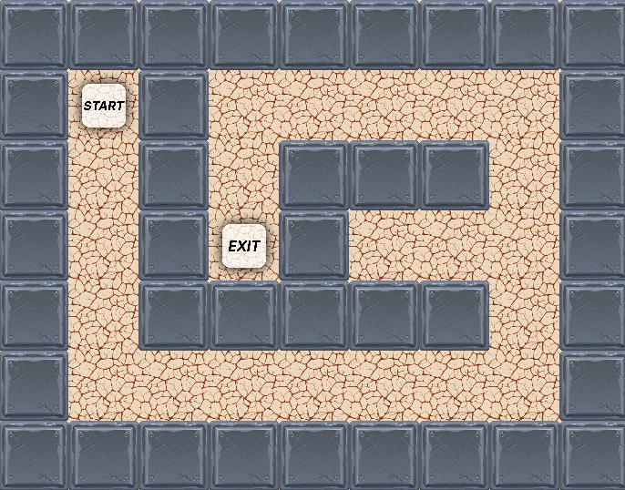

# TP n°2 : Résolution d'un labyrinthe fixé par planification

Dans ce problème, on s'intéresse à la résolution d'un labyrinthe fixé de taille quelconque. Les compétences travaillées durant cette activité sont les suivantes :

- Résoudre un problème de décision de Markov avec modèle de l'environnement connu
- Implémenter l'algorithme **Value Iteration**
- Implémenter l'algorithme **Policy Iteration**

## Partie 0 : Pour commencer

### Récupération des travaux pratiques

1. Récupérer le code source

   ```bash
   git clone https://github.com/blavad/rl.git
   cd rl
   ```

2. Créer un environnement virtuel python

   ```bash
    pip3 install virtualenv # installation virtualenv
    python3 -m venv .venv # création d'un environnement
    source .venv/bin/activate # activation de l'environnement
   ```

3. Installer des dépendances du TP 2.
   ```bash
   # Dans le dossier TP2-ModelBased
   pip3 install -r requirements.txt
   ```

### Vérifier l'installation

```bash
# Dans le dossier TP2-ModelBased
python3 main.py random
```

## Partie 1 : Théorie

30min

### Formalisation du problème

Considérons la tâche qui consiste pour un agent à se diriger vers la sortie d'un labyrinthe. On peut formuler ce problème comme un problème de décision markovien.

**L'espace d'états $\mathcal{S}$** est constitué des coordonnées $(y, x)$ du labyrinthe. Pour un labyrinthe de dimension $(n_y, n_x)$ il y a donc $n_y \times n_x$ états possibles.

**L'espace d'actions $\mathcal{A}$** comprend quatre actions distinctes (`0` pour `up`, `1` pour `down`, `2` pour `left`, `3` pour `right`).

**La fonction de récompense R** est donnée tel que suit :

- `R(s, a) = -1` pour tout $s \neq s_{exit}$, pour tout $a$

> **_Remarque :_** l'objectif est atteint quand l'agent atteint le point _exit_ et dans ce cas, l'agent perçoit une récompense nulle.

<!-- **Le gain $G_t$** -->

 <!-- est donné par $G_t = \sum_{k=0}^{N} \gamma^{k} R(s_{t+k+1}, a_{t+k +1})$ avec $\gamma = 1$ -->

  

### Exercice

Sur papier et pour chacun des cas suivants :

1. Représenter le problème sous forme d'un graphe orienté.
2. Calculer la fonction de valeur optimale $v_*$ liée au labyrinthe ci-dessus pour chacun des cas suivant.

   **Cas 1 : Transitions déterministes**

   On considèrera une dynamique déterministe.

   **Cas 2 : Nouvelle Récomponse**

   On considère désormais la fonction de récompense $R(s, a) = 0$ si $s \neq s_{exit}$ et $R(s_{exit}, a) = 100$.

   **Cas 3 : Transitions stochastiques**

   La récompense est la même que celle du 1er cas. On considèrera par contre que la fonction de transition est stochastique et on distingue deux cas :

   1. Si l'action est exécutable, c'est-à-dire qu'elle ne mène pas à un mur, alors la probabilité de succès est de 80%, la probabilité qu'elle échoue est de 20%. Lorsqu'une action échoue, l'agent reste dans la cellule courante.
   2. Si l'action est non exécutable, alors l'action échoue systématiquement et l'agent demeure dans la cellule courante.

## Partie 2 : Value Iteration

1h00

### Intro

Quand le modèle de la dynamique est connu (`p(s' | s, a)` et `r(s,a)` connus) on peut utiliser un algorithme de planification pour déterminer la politique optimale.

### Value Iteration

Il s'agit d'une méthode de résolution des processus décisionnels de Markov avec connaissance parfaite du modèle de l'environnement. L'algorithme procède de façon itérative, mettant à jour la fonction de valeur jusqu'à ce que l'écart entre deux mises à jour soit inférieur à un seuil fixé, e.g., 0.01.

### Résolution

1. Lire et compléter le fichier Value Iteration (`TP2-ModelBased/agent/viagent.py`)

   > L'état `s` correspond au couple de coordonnées `(y, x)`

1. Pour tester votre algorithme, lancer le programme principal avec l'argument `vi` (pour **v**alue **i**teration)

   ```
   python3 main.py vi
   ```

1. Commenter la ligne `env = Maze(7, 7, min_shortest_length=15)`
1. Décommenter la ligne `env = Maze.from_file("data/maze_ex2.txt")` qui correspond au labyrinthe de la partie 1
1. Comparer les résultats obtenus aux résultats théoriques

## Partie 3 : Policy Iteration

### Policy Iteration

Il s'agit d'une autre méthode de résolution des processus décisionnels de Markov avec connaissance parfaite du modèle de l'environnement. Cette méthode met à jour directement la politique d'action mais est plus coûteuse en temps.

### A faire

Sur un modèle similaire au fichier `viagent.py`, créer un fichier `piagent.py` qui implémente l'algorithme de Policy Iteration.

Pour cela :

1. Créer le fichier `piagent.py` dans le dossier `agents`
1. Créer une classe `PIAgent` qui hérite de `AgentInterface`
1. Implémenter un constructeur avec la signature suivante :

   > `def __init__(self, maze: Maze, gamma: float)`

1. Implémenter les méthodes `policy_evaluation` et `policy_improvement`

1. Implémenter la méthode `solve` qui résout le problème de décision

   > `def solve(self, error: float)`

1. Surcharger la méthode `select_action`

1. Modifier le fichier `main.py` pour tester votre algorithme. On pourra notamment insérer les lignes suivantes à l'endroit voulu :

   ```python
   elif agent == "pi":
       agent = PIAgent(env, gamma)
       agent.solve(0.01)
       test_maze(env, agent, max_steps, speed=0.1, display=True)
   ```

## Et ensuite ?

Déjà terminé ? Vous pouvez commencer [le TP n°3 sur les algorithmes d'apprentissage par renforcement](../TP3-ModelFree/README.md).
